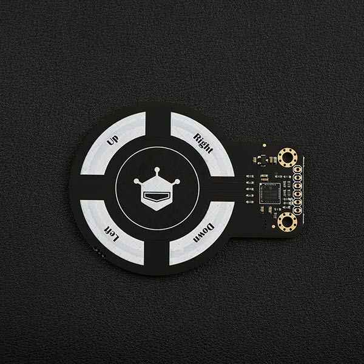

# DFRobot_MGC3130
- [English Version](./README.md)

3D手势识别传感器是一款集成3D手势识别和运动跟踪为一体的交互式传感器，传感器可以在有效范围内识别手指的顺时针/逆时针转动方向和手指的运动方向等。传感器基于Microchip专利的GestIC®技术，采用电近场传感技术，包括了开发3D手势输入传感系统所有的块图，具有先进的3D信号处理单元，有效检测距离为0~10 cm。





## 产品链接(https://www.dfrobot.com.cn/goods-1342.html)

    SKU：SEN0202

## 目录

* [概述](#概述)
* [库安装](#库安装)
* [方法](#方法)
* [兼容性](#兼容性y)
* [历史](#历史)
* [创作者](#创作者)

## 概述

库中提供了手势识别、接触识别、接近位置监测三个示例。

手势识别：左-->右、右-->左、上-->下、下-->上

接触识别：上下左右中的单击、上下左右中的双击、上下左右中的触摸

接近位置识别：X、Y、Z三轴方向上的位置数据

## 库安装

这里提供两种使用本库的方法：
1. 打开Arduino IDE,在状态栏中的Tools--->Manager Libraries 搜索"DFRobot_MGC3130"并安装本库.
2. 首先下载库文件,将其粘贴到\Arduino\libraries目录中,然后打开examples文件夹并在该文件夹中运行演示.


## 方法

```C++
  /**
   * @fn begin
   * @brief 初始化函数
   * @return 初始化结果
   * @retval true 初始化成功
   * @retval fasle 初始化失败
   */
  int begin(void);

  /**
   * @fn reset
   * @brief 复位传感器
   */
  void reset(void);

  /**
   * @fn sensorDataRecv
   * @brief 获取传感器数据
   */
  void sensorDataRecv(void);

  /**
   * @fn enableGestures
   * @brief 使能手势识别功能
   * @return 返回使能结果
   * @retval -1  设置失败
   * @retval  0  设置成功
   */
  int8_t enableGestures(void);

  /**
   * @fn disableGestures
   * @brief 关闭手势识别功能
   * @return 返回设置结果
   * @retval -1  设置失败
   * @retval  0  设置成功
   */
  int8_t disableGestures(void);

  /**
   * @fn disableAirWheel
   * @brief 关闭AirWheel功能
   * @return 返回设置结果
   * @retval -1  设置失败
   * @retval  0  设置成功
   */
  int8_t disableAirWheel(void);

  /**
   * @fn enableAirWheel
   * @brief 使能AirWheel功能
   * @return 返回设置结果
   * @retval -1  设置失败
   * @retval  0  设置成功
   */
  int8_t enableAirWheel(void);

  /**
   * @fn disableApproachDetection
   * @brief 关闭接近检测功能
   * @return 返回设置结果
   * @retval -1  设置失败
   * @retval  0  设置成功
   */
  int8_t disableApproachDetection(void);

  /**
   * @fn enableApproachDetection
   * @brief 使能接近检测功能
   * @return 返回设置结果
   * @retval -1  设置失败
   * @retval  0  设置成功
   */
  int8_t enableApproachDetection(void);

  /**
   * @fn disableTouchDetection
   * @brief 关闭接触检测功能
   * @return 返回设置结果
   * @retval -1  设置失败
   * @retval  0  设置成功
   */
  int8_t disableTouchDetection(void);

  /**
   * @fn enableTouchDetection
   * @brief 开启接触检测功能
   * @return 返回设置结果
   * @retval -1  设置失败
   * @retval  0  设置成功
   */
  int8_t enableTouchDetection(void);

  /**
   * @fn getPositionX
   * @brief 获取X轴位置
   * @return X轴位置
   */
  uint16_t getPositionX(void);

  /**
   * @fn getPositionY
   * @brief 获取Y轴位置
   * @return Y轴位置
   */
  uint16_t getPositionY(void);

  /**
   *@fn getPositionZ
   * @brief 获取Z轴位置
   * @return Z轴位置
   */
  uint16_t getPositionZ(void);

  /**
   * @fn getTouchInfo
   * @brief 获取接触信息
   * @return 接触信息:
   * @retval eDoubleTapCenter  双击"Center"电场
   * @retval eDoubleTapRight   双击"Right"电场
   * @retval eDoubleTapUp      双击"Up"电场
   * @retval eDoubleTapLeft    双击"Left"电场
   * @retval eDoubleTapDown    双击"Down"电场
   * @retval eTapCenter        单击"Center"电场
   * @retval eTapRight         单击"Right"电场
   * @retval eTapUp            单击"Up"电场
   * @retval eTapLeft          单击"Left"电场
   * @retval eTapDown          单击"Down"电场
   * @retval eTouchCenter      触摸"Center"电场
   * @retval eTouchRight       触摸"Right"电场
   * @retval eTouchUp          触摸"Up"电场
   * @retval eTouchLeft        触摸"Left"电场
   * @retval eTouchDown        触摸"Down"电场
   */
  uint16_t getTouchInfo(void);

  /**
   * @fn getGestureInfo
   * @brief 获取手势信息
   * @return 手势信息
   * @retval eFilckR                   从左到右
   * @retval eFilckL                   从右到左
   * @retval eFilckU                   从下到上
   * @retval eFilckD                   从上到下
   * @retval eCircleClockwise          圈顺时针 (only active if AirWheel disabled)
   * @retval eCircleCounterclockwise   圈逆时针 (only active if AirWheel disabled)
   */
  uint8_t getGestureInfo(void);

  /**
   * @fn havePositionInfo
   * @brief 监测是否有位置信息
   * @return 监测结果
   * @retval true  存在位置信息
   * @retval false 不存在位置信息
   */
  bool havePositionInfo(void);
```

## 兼容性

| 主板          | 通过 | 未通过 | 未测试 | 备注 |
| ------------- | :--: | :----: | :----: | ---- |
| Arduino uno   |  √   |        |        |      |
| Mega2560      |  √   |        |        |      |
| Leonardo      |  √   |        |        |      |
| ESP32         |  √   |        |        |      |
| micro:bit     |  √   |        |        |      |
| FireBeetle M0 |  √   |        |        |      |


## 历史

- 2021/10/13 - 1.0.0 版本


## 创作者

Written by yangfeng(feng.yang@dfrobot.com), 2021. (Welcome to our [website](https://www.dfrobot.com/))
